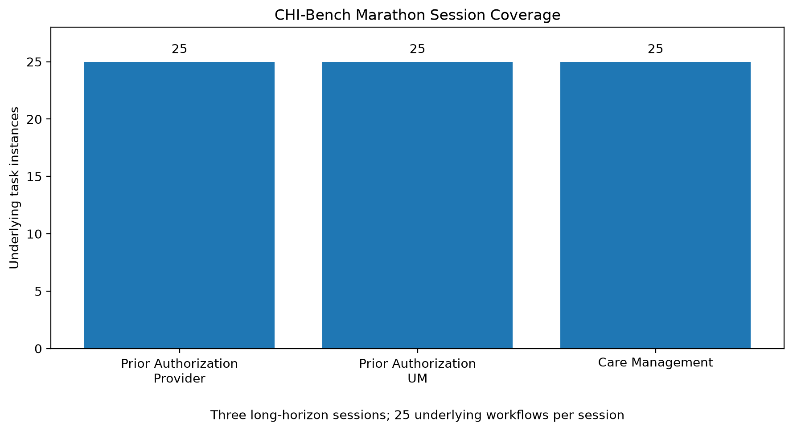

# CHI-Bench Marathon Workflow Analysis

## Overview

The CHI-Bench Marathon family provides a long-horizon execution layer over three healthcare workflow domains:

- Prior Authorization — Provider
- Prior Authorization — Payer / Utilization Management
- Care Management

Rather than introducing a separate set of clinical cases, the Marathon sessions organize the underlying workflows into extended execution sessions. Across the three session definitions, 75 underlying task instances are referenced.

This analysis uses the public Marathon session manifests and derived task metadata. Hidden evaluation artifacts, solution files, and test expectations were not inspected.

---

## Session Coverage

| Marathon session | Domain | Underlying task instances |
|---|---|---:|
| `prior_auth_provider_session_v1` | Prior Authorization — Provider | 25 |
| `prior_auth_um_session_v1` | Prior Authorization — Payer / UM | 25 |
| `care_management_session_v1` | Care Management | 25 |
| **Total** | **3 sessions** | **75** |

Each Marathon session contains the complete 25-task workflow set for its corresponding domain.

---

## Long-Horizon Orchestration

The Marathon family differs from the individual workflow families because its primary structural characteristic is session length.

The three sessions collectively reference:

- 25 provider-side prior authorization workflows
- 25 payer-side utilization-management workflows
- 25 care-management workflows

This produces 75 underlying task instances within the Marathon layer.

These 75 instances should not be interpreted as 75 additional unique patients or clinical cases. The Marathon manifests reference workflows already represented in the benchmark's underlying task families.

The design therefore adds an execution and orchestration dimension rather than simply increasing the number of clinical scenarios.

---

## PA-UM Starting-State Preservation

The Prior Authorization — Payer / Utilization Management Marathon session preserves the starting workflow state for each underlying task.

| Initial state | Count | Share |
|---|---:|---:|
| Nurse review | 8 | 32% |
| Intake | 5 | 20% |
| Medical review | 4 | 16% |
| Triage | 4 | 16% |
| Peer-to-peer | 4 | 16% |
| **Total** | **25** | **100%** |

Nurse review is the largest starting-state category, representing 8 of the 25 PA-UM workflows.

The preservation of starting states is important because the Marathon session does not reduce every underlying case to a common initial condition. Instead, the session retains stage-specific workflow context.

---

## Comparison With Individual Workflow Analyses

The Marathon layer complements the task-level analyses conducted elsewhere in this repository.

| Analysis layer | Coverage | Primary analytical focus |
|---|---:|---|
| Provider Prior Authorization | 25 workflows | Condition diversity and policy-reference complexity |
| Payer Utilization Management | 25 workflows | Workflow stages, documentation volume, and policy complexity |
| Care Management | 25 workflows | Engagement scenarios and condition diversity |
| Prior Authorization E2E | 23 workflows | Provider-to-payer handoff structure |
| Marathon | 3 sessions / 75 underlying task instances | Long-horizon orchestration and state preservation |

This distinction is useful when interpreting benchmark complexity. Individual workflow analyses examine the characteristics of individual tasks, while Marathon examines sustained execution across many workflows in a single session.

---

## Key Findings

### 1. Three extended sessions

The Marathon family contains three session definitions spanning provider prior authorization, payer utilization management, and care management.

### 2. Complete domain coverage

Each Marathon session references all 25 workflows from its corresponding underlying domain.

### 3. Long-horizon execution

The combined Marathon layer references 75 underlying task instances, making sustained context management and reliable execution central characteristics of the evaluation.

### 4. Workflow state is preserved

The PA-UM Marathon explicitly retains five different starting states: intake, triage, nurse review, medical review, and peer-to-peer.

### 5. Marathon is not additional case volume

The 75 underlying task instances should not be counted as 75 additional unique clinical cases. They represent long-horizon orchestration of workflows already present elsewhere in the benchmark.

---

## Portfolio Interpretation

From a healthcare analytics and automation perspective, Marathon represents a useful extension beyond isolated task completion.

Real operational systems may need to process multiple referrals, utilization-management cases, or care-management workflows during a sustained operating session. Such systems must maintain context, preserve workflow state, avoid cross-case contamination, and execute consistently over longer sequences.

The Marathon structure therefore provides a benchmark perspective on **sustained multi-workflow execution**, complementing the repository's analyses of individual workflow complexity.

For an analytics portfolio, this demonstrates an understanding that healthcare AI system performance is not only about completing one clinical task correctly. It can also depend on maintaining reliable state and workflow context across repeated operations.

---

## Limitations

This analysis describes benchmark structure rather than real-world healthcare utilization.

The task counts represent benchmark workflow definitions and session references. They should not be interpreted as patient prevalence, clinical prevalence, utilization rates, or real-world workflow frequencies.

The analysis is based on the public Marathon session manifests and derived metadata. Hidden evaluation artifacts, solution files, and test expectations were intentionally excluded.

---

## Conclusion

CHI-Bench Marathon adds a long-horizon orchestration dimension to the benchmark.

Across three sessions, the Marathon family covers the complete 25-task sets for provider prior authorization, payer utilization management, and care management, resulting in 75 underlying task instances. The PA-UM session additionally preserves stage-specific starting states across its 25 workflows.

The Marathon analysis therefore complements the repository's task-level studies by shifting the analytical perspective from **individual workflow characteristics** to **sustained multi-workflow execution and workflow-state preservation**.