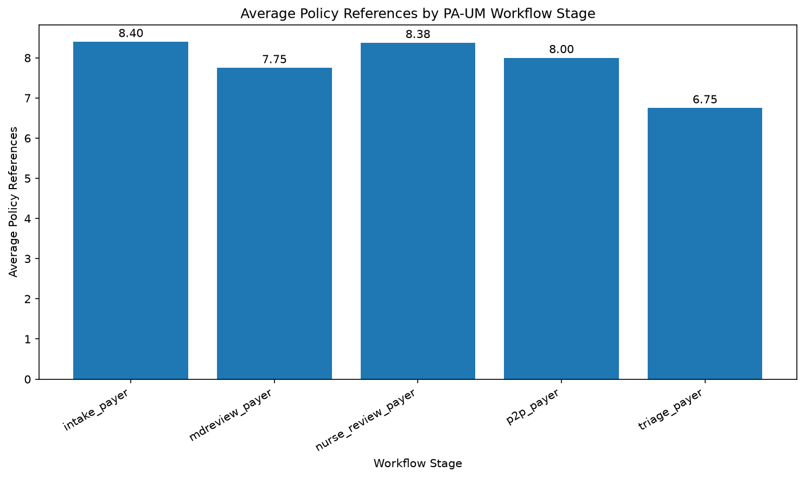

# CHI-Bench PA-UM Workflow Analysis

## 1. Objective

This analysis characterizes the payer-side prior authorization and utilization-management (PA-UM) workflows in CHI-Bench.

The objective is to describe workflow-stage distribution, request-document volume, policy-reference complexity, and selected condition-label patterns using task metadata and allowed task assets.

The analysis is descriptive and does not evaluate model performance or clinical difficulty.

## 2. Scope

The analysis covers all 25 PA-UM workflow entries in the benchmark.

| Metric                                 | Value |
| -------------------------------------- | ----: |
| PA-UM workflows                        |    25 |
| Total request documents                |   111 |
| Average request documents per workflow |  4.44 |
| Total policy references                |   199 |
| Average policy references per workflow |  7.96 |
| Policy-reference range                 |  6–10 |

## 3. Workflow Stage Distribution

The 25 workflows span five payer-side workflow stages.

| Workflow stage        | Workflows |    Share |
| --------------------- | --------: | -------: |
| Nurse clinical review |         8 |    32.0% |
| Intake                |         5 |    20.0% |
| MD review             |         4 |    16.0% |
| Peer-to-peer          |         4 |    16.0% |
| Triage                |         4 |    16.0% |
| **Total**             |    **25** | **100%** |

Nurse clinical review is the largest stage, accounting for 8 of the 25 workflow entries.

The other stages are distributed relatively evenly, with intake representing 20% and MD review, peer-to-peer, and triage each representing 16%.

## 4. Request-Document Volume

The workflows contain 111 request documents in total, averaging 4.44 documents per workflow.

| Request documents | Workflows |    Share |
| ----------------: | --------: | -------: |
|                 3 |         3 |    12.0% |
|                 4 |        11 |    44.0% |
|                 5 |         8 |    32.0% |
|                 6 |         3 |    12.0% |
|         **Total** |    **25** | **100%** |

Eleven of the 25 workflows (44%) contain five or more request documents.

This indicates that a substantial portion of the payer-side workflows involve multiple incoming clinical or administrative documents rather than a single request artifact.

## 5. Policy-Reference Complexity

Policy-reference counts range from 6 to 10 per workflow, with an average of 7.96.

| Policy references | Workflows |    Share |
| ----------------: | --------: | -------: |
|                 6 |         4 |    16.0% |
|                 7 |         4 |    16.0% |
|                 8 |         9 |    36.0% |
|                 9 |         5 |    20.0% |
|                10 |         3 |    12.0% |
|         **Total** |    **25** | **100%** |

Seventeen of the 25 workflows (68%) reference at least eight policy files.

This provides evidence that the PA-UM task environment involves substantial multi-policy documentation rather than simple single-policy lookup.

## 6. Stage-Level Workflow Complexity

The stage-level summary combines workflow counts with request-document and policy-reference volumes.

| Workflow stage        | Workflows | Avg. documents | Avg. policies | Policy range |
| --------------------- | --------: | -------------: | ------------: | -----------: |
| Intake                |         5 |           3.80 |          8.40 |          8–9 |
| MD review             |         4 |           5.00 |          7.75 |          6–9 |
| Nurse clinical review |         8 |           4.50 |          8.38 |         6–10 |
| Peer-to-peer          |         4 |           4.75 |          8.00 |          7–9 |
| Triage                |         4 |           4.25 |          6.75 |          6–8 |

MD review workflows have the highest average request-document count at 5.00.

Intake and nurse clinical review have the highest average policy-reference counts, at 8.40 and 8.38 respectively.

Triage has the lowest average policy-reference count at 6.75.

These values describe the available benchmark task assets and should not be interpreted as measures of clinical complexity or workflow difficulty.

## 7. Condition-Label Patterns

The extracted metadata contains 25 non-empty condition entries representing 22 distinct condition labels.

Three labels occur twice:

* Headache — 2 workflows
* Complete rotator cuff tear or rupture of right shoulder — 2 workflows
* Rheumatoid arthritis — 2 workflows

Condition labels should be interpreted as benchmark metadata rather than as a patient-level population analysis. Similar clinical concepts may appear under different textual labels.

## 8. Visualization

The analysis includes a stage-level visualization of average policy-reference volume:

The visualization highlights differences in policy-reference volume across the five payer-side workflow stages.

## 9. Key Observations

The PA-UM benchmark contains 25 payer-side authorization workflows distributed across intake, triage, nurse review, MD review, and peer-to-peer stages.

The workflows contain 111 request documents and 199 policy references. On average, each workflow contains 4.44 request documents and 7.96 policy references.

Policy-reference volume is particularly notable: 68% of workflows reference at least eight policy files.

The combination of multiple incoming documents and multiple policy references indicates a benchmark environment involving information retrieval, documentation review, policy matching, and structured utilization-management workflow execution.

## 10. Interpretation

From a healthcare analytics perspective, the PA-UM domain provides a structured example of payer-side operational workflows involving:

* Clinical and administrative information retrieval
* Multi-document review
* Policy and guideline lookup
* Evidence-to-policy matching
* Workflow-stage routing
* Clinical review handoffs
* Peer-to-peer workflow execution
* Determination-related documentation

These observations describe the structure of the benchmark. They do not represent measurements of model accuracy, clinical quality, or task difficulty.

## 11. Limitations

* The analysis covers 25 PA-UM benchmark workflow entries.
* Task entries should not be interpreted as 25 unique patients or independent clinical populations.
* Request-document counts represent available task assets and do not measure the amount of information contained within each document.
* Policy-reference counts represent associated policy files and do not measure policy complexity or clinical difficulty.
* Condition diversity is based on textual labels and may not perfectly represent distinct clinical concepts.
* Hidden evaluation artifacts, including solutions, tests, expectations, rubrics, and canonical evaluation records, were not used for the analytical conclusions.
* The analysis does not measure model performance because no authenticated benchmark experiment was used to generate performance results.

## 12. Reproducibility

The analysis is implemented in:

`analysis/notebooks/02_pa_um_workflow_analysis.ipynb`

The source metadata is:

`analysis/data/pa_um_task_metadata.csv`

The generated visualization is:

`analysis/figures/pa_um_policy_complexity_by_stage.png`

The metadata extraction script is:

`analysis/scripts/extract_pa_um_metadata.py`

The report is:

`analysis/reports/pa_um_workflow_analysis.md`

## 13. Project Relevance

This analysis establishes a reproducible analytical baseline for the payer-side utilization-management domain of CHI-Bench.

Together with the provider-side workflow analysis, it provides two complementary views of prior authorization operations: provider-side referral preparation and payer-side utilization-management processing.

The analysis package can subsequently be extended to additional CHI-Bench workflow families, including care management, while maintaining separate domain-specific metrics and interpretations.