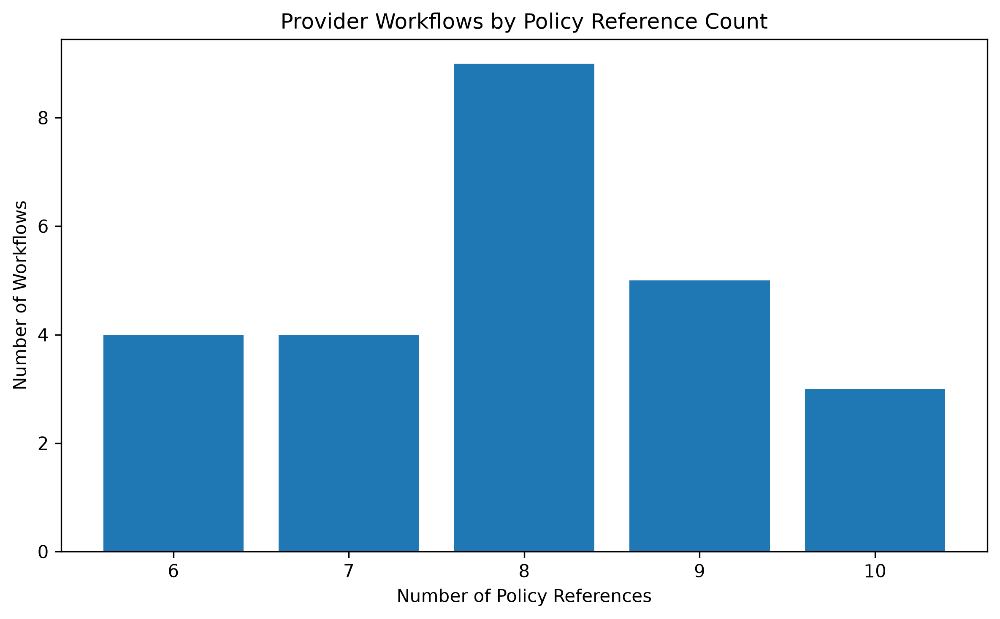

# CHI-Bench Provider Workflow Analysis

## 1. Objective

This analysis characterizes the provider-side prior authorization workflows in CHI-Bench using task metadata and allowed task assets. The goal is to describe workflow diversity, documentation volume, and policy-reference complexity without inspecting hidden evaluation artifacts.

## 2. Scope

The analysis covers all 25 provider-side prior authorization workflows.

| Metric                                 | Value |
| -------------------------------------- | ----: |
| Provider workflows                     |    25 |
| Distinct condition titles              |    21 |
| Total fixture files                    |   324 |
| Total policy references                |   199 |
| Average fixtures per workflow          | 12.96 |
| Average policy references per workflow |  7.96 |
| Policy-reference range                 |  6–10 |

## 3. Condition Diversity

The 25 provider workflows cover 21 distinct condition titles.

Four condition titles occur twice:

* Obstructive sleep apnea — 2 workflows
* Headache — 2 workflows
* Complete rotator cuff tear or rupture of right shoulder — 2 workflows
* Rheumatoid arthritis — 2 workflows

The remaining 17 condition titles occur once.

This provides repeated clinical themes while retaining substantial condition diversity across the provider workflow set.

## 4. Policy Reference Complexity

The number of policy references associated with each workflow ranges from 6 to 10.

| Policy references | Number of workflows |
| ----------------: | ------------------: |
|                 6 |                   4 |
|                 7 |                   4 |
|                 8 |                   9 |
|                 9 |                   5 |
|                10 |                   3 |
|         **Total** |              **25** |

Seventeen of the 25 workflows (68%) reference at least eight policy files.

## 5. Key Observation

The provider benchmark contains 25 workflows spanning 21 distinct condition titles. Each workflow references 6–10 policy files, with 68% of workflows having at least 8 policy references.

This indicates a multi-source policy and documentation environment rather than a single-rule lookup task.

## 6. Interpretation

The metadata indicates that provider-side workflows combine clinical context with multiple supporting documents and policy references.

From an analytics perspective, this creates a workflow environment involving several information-management activities, including:

* Clinical information retrieval
* Policy and guideline lookup
* Evidence collection
* Documentation assembly
* Structured authorization workflow execution
* Handoff of information to downstream utilization-management processes

These observations describe the structure of the benchmark. They do not represent measurements of model performance or clinical difficulty.

## 7. Limitations

* This analysis uses task metadata and allowed task assets only.
* Hidden solutions, tests, expectations, rubrics, and scoring artifacts were intentionally excluded.
* Fixture and policy-reference counts describe available task assets; they do not by themselves indicate clinical difficulty or model performance.
* Repeated condition titles represent multiple workflows and should not be interpreted as duplicate patients.
* The 25 provider workflows represent benchmark task entries, not 25 unique patients.

## 8. Reproducibility

The analysis is implemented in:

`analysis/notebooks/01_provider_workflow_analysis.ipynb`

The source metadata used by the notebook is:

`analysis/data/provider_task_metadata.csv`

The generated visualization is:

`analysis/figures/provider_policy_complexity.png`

The final report is:

`analysis/reports/provider_workflow_analysis.md`

## 9. Project Relevance

This analysis establishes a structured analytical baseline for the CHI-Bench provider workflow domain.

The resulting notebook, metadata table, visualization, and report form a reproducible analysis package that can be extended later with additional workflow families such as payer-side utilization management and care management.
